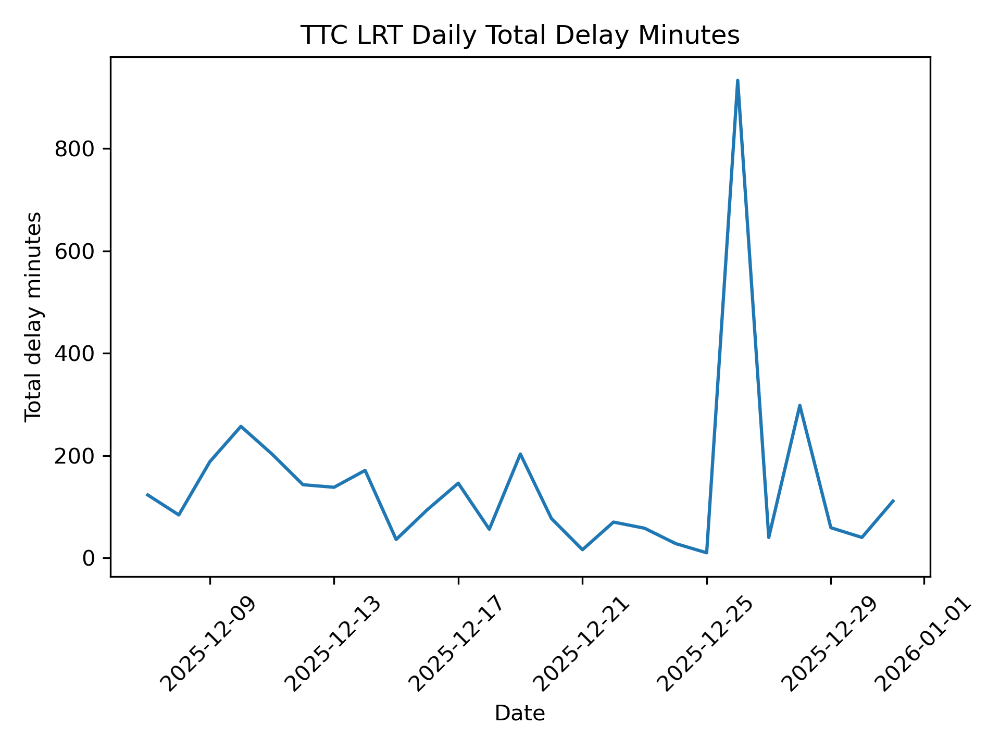

## Visualization 1: TTC LRT Daily Total Delay Minutes Over Time (Line Chart)

**What software did you use to create your data visualization?**  
This visualization was created using Python, specifically the pandas library for data manipulation and matplotlib for plotting.

**Who is your intended audience?**  
The intended audience includes transit planners, operations analysts and policy stakeholders interested in understanding temporal patterns in TTC LRT service delays.

**What information or message are you trying to convey with your visualization?**  
The visualization conveys how the total number of delay minutes experienced by TTC LRT services varies over time, highlighting periods of increased disruption and enabling identification of temporal trends in service reliability.

**What aspects of design did you consider when making your visualization? How did you apply them? With what elements of your plots?**  
A line chart was selected to emphasize change over time. Dates were placed on the horizontal axis and total delay minutes on the vertical axis to align with standard temporal visualization conventions. Minimal styling, a single line, and clear axis labels were used to maintain clarity and reduce visual clutter.

**How did you ensure that your data visualizations are reproducible? If the tool you used to make your data visualization is not reproducible, how will this impact your data visualization?**  
The visualization is fully reproducible. The Python script reads the raw CSV dataset, applies deterministic transformations and saves the output as a static image. Any user with access to the dataset and script can regenerate the visualization.

**How did you ensure that your data visualization is accessible?**  
Accessibility was considered by using clear axis labels, a descriptive title, sufficient contrast and avoiding reliance on color to encode meaning. The chart avoids unnecessary visual complexity and is readable in grayscale.

**Who are the individuals and communities who might be impacted by your visualization?**  
TTC riders, particularly those who rely on LRT services for daily transportation as well as planners responsible for maintaining equitable and reliable transit service.

**How did you choose which features of your chosen dataset to include or exclude from your visualization?**  
The Date and Min Delay variables were selected to capture the temporal burden of delays. Other operational variables, such as vehicle identifiers, were excluded to maintain focus on system-level delay trends.

**What ‘underwater labour’ contributed to your final data visualization product?**  
Inspecting the dataset structure, converting date fields, validating aggregation choices, and iteratively testing visualization outputs contributed to the final product.
